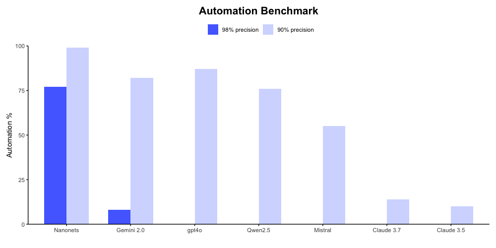
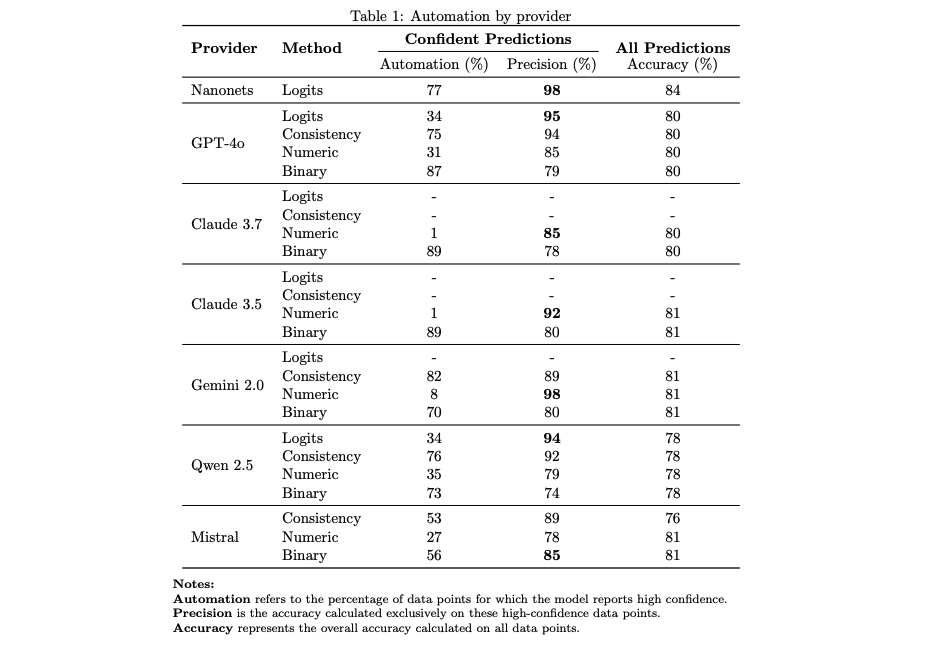

# AutoBench: Benchmarking *Automation* for Intelligent Document Processing (IDP) with confidence

AutoBench is an **automation-cenrtic** benchmark designed to evaluate Large Models (LLMs and VLMs) for **Intelligent Document Processing (IDP)**.  
In addition to performance assessment of LMs for structured information extraction and delivering key metrics, it uniquely emphasizes **prediction confidence scores** to enhance *automation* in IDP pipelines. 

What sets AutoBench apart is its focus on confidence scores, essential for **automating** IDP workflows. Confidence scores enable systems to:

*   **Automate validation** of high-confidence extractions, minimizing manual review.
*   **Intelligently route** low-confidence predictions for human-in-the-loop verification, streamlining exception handling.
*   **Optimize IDP pipelines** by leveraging confidence to prioritize document routing and manual intervention.

<p align="center">
    
    
</p>

**Figure: Benchmark Results** – A comparison of confidence benchmarks and detailed performance metrics.  
For a full analysis, visit [this detailed report](https://nanonets.com/automation-benchmark).  

## Setup

### 1. Install Dependencies

To install the required dependencies, run:

```bash
pip install -e .
```

### 2. Configure API Keys and Base URLs

API keys and base URLs must be set using an `.env` file.

#### Steps to Configure:

1. **Create the `.env` file:** Copy `.env.example` to `.env` in the project root directory.
    ```bash
    cp .env.example .env
    ```
2. **Set API keys and base URLs:** Edit the `.env` file and provide the necessary values for the models you intend to benchmark.

    Example `.env` file:
    ```
    OPENAI_API_KEY=sk-...  # Your OpenAI API Key
    CLAUDE_API_KEY=sk-ant-...  # Your Anthropic Claude API Key
    QWEN2_API_BASE_URL=http://your-qwen2-api:8000/v1  # API Base URL for Qwen2
    GPT4V_API_BASE_URL=https://api.openai.com/v1  # API Base URL for GPT-4V
    # Add API keys and base URLs for other models as needed
    ```

    **Important:** Ensure both API keys and base URLs are correctly set for each model before running benchmarks. Refer to `.env.example` for required variable names.

### 3. Run Benchmarks

The benchmarking process is executed using `benchmark.py`.

## Usage

Run the benchmark script with the following command:

```bash
python tools/benchmark.py <model_name> --input_file <path_to_input_jsonl_file> [options]
```

### Arguments:

- `<model_name>`: The model to evaluate (`qwen2`, `gpt4v`, `gpt4o`, etc.).
- `--input_file <path>`: Path to the JSONL dataset containing input data.

### Optional Parameters:

- `--max_workers <int>`: Number of worker threads (default: 16).
- `--few_shot <int>`: Number of few-shot examples (default: 1).
- `--layout <string>`: Input text layout (default: `default`).
- `--conf_score_method <string>`: Method for computing confidence scores (`prob`, `yes_no`, `consistency`, default: `prob`).
- `--limit <int>`: Number of document samples to benchmark.

### Example:

```bash
python tools/benchmark.py gpt4o --input_file data/your_dataset.jsonl --max_workers 32 --few_shot 1 --conf_score_method prob --limit 10
```

## Output

Benchmark results are saved as JSONL files in the `results/` directory, following the naming convention:

```
benchmark_results_<model_name>_<dataset_name>_<layout>_<conf_score_method>_<timestamp>.jsonl
```

Each result entry includes:

- Execution time and API usage.
- Input paths and annotations.
- Prompts and raw model responses.
- Performance metrics: `parsing_accuracy`, `predicted_field_conf_scores`, `file_accuracy`, etc.

Summary metrics are also printed to the console.

**Note on Result Variability:** Due to the inherent stochastic nature of Large Language Models, slight variations in benchmark results may be observed across different runs. For reference, our benchmark results are available in the [`results`](results/) folder, providing a consistent baseline for comparison.

### Metrics Explained

1. **Approval Accuracy** (`correct_approved / (correct_approved + incorrect_approved)`):
   - **Definition**: The proportion of predictions approved by the confidence threshold (e.g., ≥0.99) that are correct compared to ground truth.
   - **Purpose**: Measures how reliable the model's high-confidence predictions are. A high value indicates that when the model is confident, it’s usually right.
   - **Example**: If 95 out of 100 approved predictions are correct, Approval Accuracy is 0.95.

2. **Approval Rate** (`(correct_approved + incorrect_approved) / total_fields`):
   - **Definition**: The fraction of all fields that the model approves with high confidence (correct or incorrect).
   - **Purpose**: Indicates the model's tendency to confidently predict values. A high rate means the model frequently trusts its outputs, but accuracy depends on Approval Accuracy.
   - **Example**: If 980 out of 1000 fields are approved, Approval Rate is 0.98.

3. **Parsing Accuracy** (Mean of `parsing_accuracy`):
   - **Definition**: The proportion of results where the model's output was successfully parsed into a valid JSON dictionary.
   - **Purpose**: Assesses the model's ability to produce well-formed, machine-readable outputs. A value of 1 means perfect parsing, 0 means a failure (e.g., malformed JSON).
   - **Example**: If 995 out of 1000 results parse correctly, Parsing Accuracy is 0.995.

4. **Average Accuracy** (Mean of `file_accuracy`):
   - **Definition**: The average field-level accuracy across all results, where `file_accuracy` is the proportion of correctly predicted fields per document (using edit distance for leniency).
   - **Purpose**: Provides an overall measure of how well the model extracts fields compared to ground truth, accounting for partial matches via edit distance.
   - **Example**: If `file_accuracy` averages 0.975 across 1000 documents, Average Accuracy is 0.975.

5. **True Positives (tp)**:
   - **Definition**: The sum of similarity scores (1 - edit_distance/max_length) for fields where predictions partially or fully match ground truth.
   - **Purpose**: Quantifies correct predictions with leniency for minor errors (e.g., typos). Higher values indicate better alignment with ground truth.
   - **Example**: A field with "01 Sep 1967" vs. "01 Sep 1967" scores 1.0; "01 Sep 1967" vs. "01 Sep 1968" might score 0.9.

6. **False Positives (fp)**:
   - **Definition**: The sum of mismatch scores (edit_distance/max_length) for fields where predictions differ from ground truth.
   - **Purpose**: Measures the extent of incorrect predictions. Lower values mean fewer errors.
   - **Example**: "01 Sep 1967" vs. "10 Dec 1988" might contribute 0.7 to fp.

7. **False Negatives (fn)**:
   - **Definition**: The sum of mismatch scores for fields present in ground truth but not correctly predicted (or missing).
   - **Purpose**: Captures missed detections. Lower values indicate better recall.
   - **Example**: If a field is in ground truth but predicted as "", fn increases.

8. **True Positives Strict (tp_strict)**:
   - **Definition**: The count of fields where predictions exactly match ground truth (no leniency).
   - **Purpose**: Provides a strict measure of precision, useful for applications requiring exact matches.
   - **Example**: "STEVE" vs. "STEVE" adds 1; "STEVE" vs. "STEVEN" adds 0.

9. **False Positives Strict (fp_strict)**:
   - **Definition**: The count of fields where predictions differ from ground truth (exact match only).
   - **Purpose**: Highlights errors in a strict context. Lower values mean fewer exact mismatches.
   - **Example**: "STEVE" vs. "STEVEN" adds 1.

10. **False Negatives Strict (fn_strict)**:
    - **Definition**: The count of fields in ground truth not exactly matched by predictions.
    - **Purpose**: Measures strict recall failures. Lower values indicate better exact coverage.
    - **Example**: A missing or incorrect field adds 1.

11. **Total Ground Truth Fields (total_gt_fields)**:
    - **Definition**: The number of fields in the ground truth annotation for a document.
    - **Purpose**: Provides context for other metrics by showing the expected number of fields.
    - **Example**: 11 fields in the annotation means `total_gt_fields = 11`.

12. **Total Predicted Fields (total_pred_fields)**:
    - **Definition**: The number of fields in the model's prediction for a document.
    - **Purpose**: Indicates how many fields the model attempted to extract, useful for spotting over- or under-prediction.
    - **Example**: 11 predicted fields means `total_pred_fields = 11`.

### Additional Notes
- **File Accuracy**: Calculated per document as `tp / len(queried_labels)`, then averaged for Average Accuracy. It balances precision and recall with leniency.
- **Correct/Incorrect Approved**: Depend on a confidence threshold (e.g., 0.99) from `predicted_field_conf_scores`. These reflect the model's self-assessment reliability.

These metrics collectively evaluate the model's performance in accuracy, reliability, and output quality, tailored to your OCR benchmark's needs. Let me know if you'd like these integrated into the script's output!

## Code Structure

The repository is organized as follows:

- **`nnautobench/config/`** – Configuration files (`config.py`).
- **`nnautobench/inference/`** – Inference logic (`predictor.py`).
- **`nnautobench/models/`** – Vision-Language model implementations.
- **`nnautobench/utils/`** – Utility functions for JSON handling, metric computations, and prompt management.
- **`results/`** – Directory for storing benchmark outputs.
- **`tools/benchmark.py`** – Main script for running benchmarks.

### Model Versions and Benchmark Results

The benchmark was conducted using the following model versions. Links to our benchmark result files are provided for each model to facilitate result verification and comparison.  **Note:** Due to the stochastic nature of LLMs, your benchmark runs may exhibit slight variations from our provided results.

| Model Name      | Specific Version                | Model Type | Benchmark Results                                                                 |
|-----------------|---------------------------------|------------|-----------------------------------------------------------------------------------|
| Qwen2           | `Qwen2.5_72B`                   | LLM        | [Qwen2.5 (prob)](results/qwen_prob.jsonl) |
| Pixtral         | `Pixtral-12B-2409`              | VLM        | [Pixtral (prob)](results/pixtral_prob.jsonl) |
| GPT-4V          | `gpt-4o-2024-11-20`             | LLM        | [GPT4V](results/gpt_logits.jsonl)   |
| GPT-4o          | `gpt-4o-2024-11-20`             | LLM        | [GPT4o (Prob)](results/gpt4o_prob.jsonl)   |
| GPT-o3-mini     | `o3-mini`                       | LLM        | [o3 Mini ]() |
| Nanonets        | `nanonets-internal-model`       | Prop.      | [Nanonets](results/nanonets.jsonl)   |
| DSv3            | `deepseekv3`                    | LLM        | [DeepSeekV3 ()]()     |
| Gemini Flash 2  | `gemini-2.0-flash`              | LLM        | [Gemini Flash 2.0 (prob)](results/gemini_prob.jsonl)   |
| Claude 3.5      | `claude-3-5-sonnet-20241022`    | LLM        | [Claude 3.5 (prob)](results/claude_35_prob.jsonl) |
| Claude 3.7      | `claude-3-7-sonnet-20250219`    | LLM        | [Claude 3.7 (prob)](results/claude_37_prob.jsonl) |
| Mistral Large   | `mistral-large-latest`          | LLM        | [Mistral Large (prob)]() |


---

## Future Improvements

- Add more models to the benchmark.
- Add more confidence scoring methods.

Reachout to us at [Placeholder](mailto:benchmarks@nanonets.com) for any questions or feedback.

---

*AutoBench provides a enhanced approach to evaluating Large Models for **automation** of document intelligence tasks*